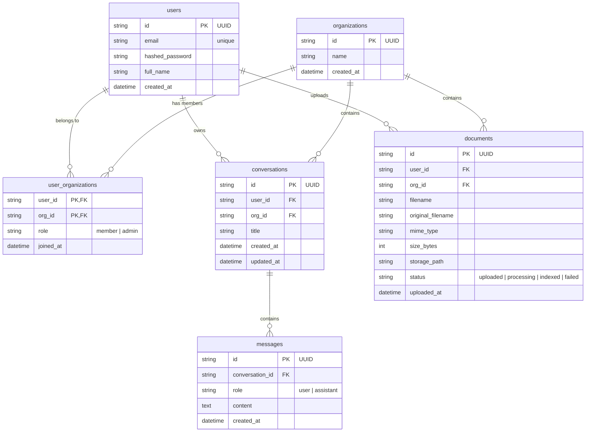

# Database Schema

## ER Diagram

## Design Decisions

| Decision | Choice | Reason |
|----------|--------|--------|
| Primary keys | UUID (string) | Distributed-friendly; prevents ID enumeration attacks |
| `updated_at` on conversations | Bumped explicitly in `message_repository.create` | SQLAlchemy's `onupdate` does not fire on child inserts; the dashboard sorts by this column |
| Indexes | `(org_id, user_id, updated_at DESC)` on conversations; `(org_id, user_id)` on documents; `(conversation_id, created_at)` on messages; `(user_id)` on users | `org_id` leads on conversations and documents because every list query now carries it — the coarser filter eliminates more rows first |
| `documents.status` enum | `uploaded / processing / indexed / failed` | Signals AI-readiness; hooks into a future RAG pipeline |
| Delete strategy | Hard delete + CASCADE | Simple, no orphan rows, avoids over-engineering |
| Enum storage | `VARCHAR + CHECK` (not native PG `ENUM`) | Adding a value is a constraint swap, not an `ALTER TYPE` that cannot run in a transaction |
| `org_id` nullability | Nullable in migration, `NOT NULL` in models | Allows the migration to run before a backfill; the model reflects the intended steady-state. Step 3 (SET NOT NULL) is deferred — see `ASSUMPTIONS.md` |
| Org membership | Join table `user_organizations` with `role` column | Covers both membership checks and admin-only operations without a schema change |
