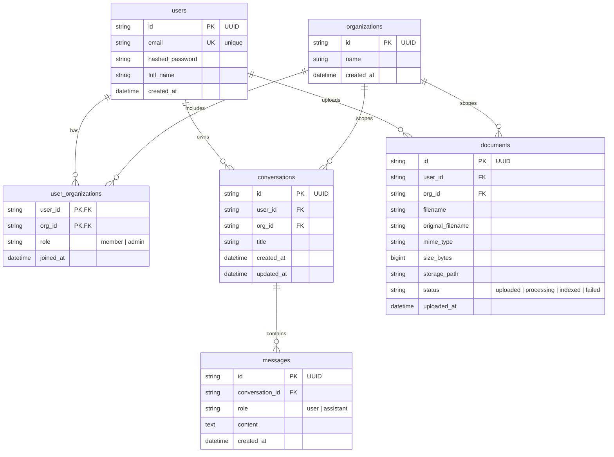

# Database Schema

## ER Diagram

## Tables

### `users`

Stores credentials and basic profile information. `email` is unique. Deleting a user
cascades to their memberships, conversations, documents, and the messages below those
conversations.

### `organizations`

Represents a tenant/workspace. Membership is expressed through `user_organizations`, so
a user can belong to multiple organizations and an organization can contain multiple
users.

### `user_organizations`

Join table between users and organizations. The composite primary key
`(user_id, org_id)` prevents duplicate memberships. `role` is constrained to `member` or
`admin`; organization creators receive the `admin` role. Deleting either parent cascades
to the membership row.

### `conversations`

Each conversation records both its creating user and its organization. Application
queries scope access by both `user_id` and `org_id`. Deleting the owning user or
organization deletes the conversation, and deleting the conversation cascades to its
messages.

### `messages`

Stores the ordered history of a conversation. `role` is constrained to `user` or
`assistant`. A message insert explicitly bumps its parent conversation's `updated_at`;
SQLAlchemy `onupdate` alone does not run when only a child row is inserted.

### `documents`

Stores upload metadata and the server-managed storage location. Each document records
both its uploader and organization. `status` is constrained to `uploaded`, `processing`,
`indexed`, or `failed`, leaving a state hook for a future indexing pipeline.

## Relationships and Delete Behaviour

| Parent | Child | Cardinality | On delete |
|---|---|---|---|
| `users` | `user_organizations` | one-to-many | `CASCADE` |
| `organizations` | `user_organizations` | one-to-many | `CASCADE` |
| `users` | `conversations` | one-to-many | `CASCADE` |
| `organizations` | `conversations` | one-to-many | `CASCADE` |
| `conversations` | `messages` | one-to-many | `CASCADE` |
| `users` | `documents` | one-to-many | `CASCADE` |
| `organizations` | `documents` | one-to-many | `CASCADE` |

## Indexes and Constraints

| Table | Index or constraint | Purpose |
|---|---|---|
| `users` | Unique index on `email` | Prevents duplicate accounts and supports login lookup |
| `user_organizations` | Primary key `(user_id, org_id)` | Prevents duplicate memberships and supports membership checks |
| `user_organizations` | `CHECK role IN ('member', 'admin')` | Enforces membership roles in PostgreSQL |
| `conversations` | `(org_id, user_id, updated_at)` | Supports org/user-scoped lists and recent-conversation sorting |
| `messages` | `(conversation_id, created_at)` | Supports chronological conversation history |
| `messages` | `CHECK role IN ('user', 'assistant')` | Enforces message roles in PostgreSQL |
| `documents` | `(org_id, user_id)` | Supports org/user-scoped document lists and dashboard counts |
| `documents` | `CHECK status IN ('uploaded', 'processing', 'indexed', 'failed')` | Enforces document workflow states |

Enums use `VARCHAR + CHECK` rather than native PostgreSQL `ENUM` types. Adding a value is
therefore a transactional constraint replacement rather than a non-transactional
`ALTER TYPE` operation.

## Design Decisions

| Decision | Choice | Reason |
|---|---|---|
| Primary keys | UUID stored as `VARCHAR(36)` | Avoids sequential public identifiers and keeps IDs portable across layers |
| Membership model | Explicit `user_organizations` join table | Supports many-to-many membership and per-membership roles |
| Resource scope | Both `user_id` and `org_id` on conversations/documents | Preserves private user ownership inside the selected organization |
| Active organization | Request context, not a column on `users` | Allows switching organizations without changing identity or issuing a new JWT |
| Conversation activity | `onupdate` plus explicit bump on message creation | Keeps recent-conversation ordering correct for title and child-message changes |
| Delete strategy | Hard delete with foreign-key `CASCADE` | Prevents orphan rows without adding soft-delete complexity |
| Enum storage | `VARCHAR + CHECK` | Retains database validation while keeping future value changes transactional |

## Migration Note

The organization migration first introduces `conversations.org_id` and
`documents.org_id` as nullable. Follow-up migration `b2c3d4e5f6a7` assigns legacy
resources to each user's earliest organization membership. If a legacy user has no
membership, it creates a default workspace with that user as admin. It then sets both
columns to `NOT NULL`, so the final migrated schema matches the SQLAlchemy models and
enforces that every resource belongs to exactly one organization.
