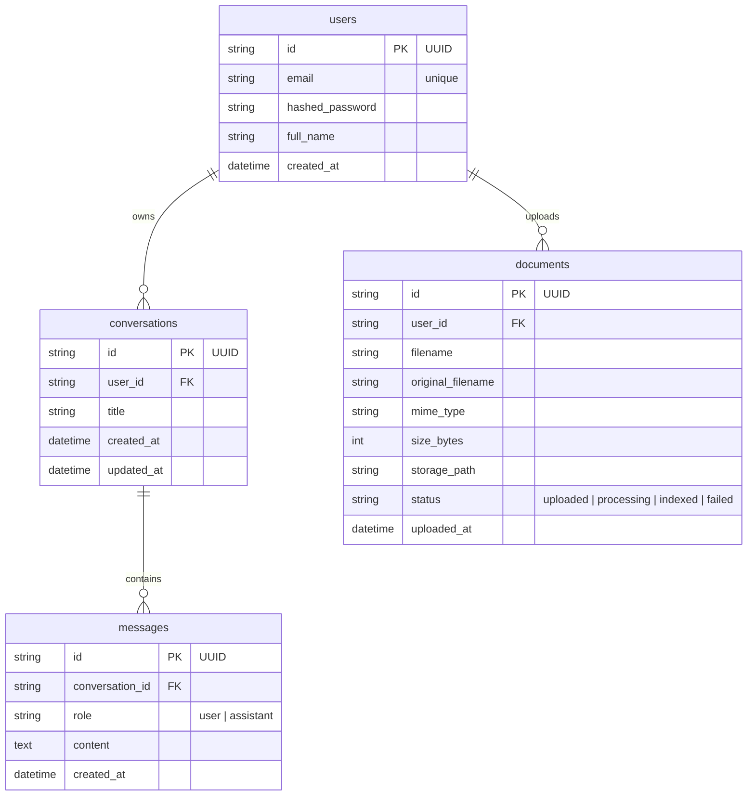

# Database Schema

## ER Diagram

## Design Decisions

| Decision | Choice | Reason |
|----------|--------|--------|
| Primary keys | UUID (string) | Distributed-friendly; prevents ID enumeration attacks |
| `updated_at` on conversations | SQLAlchemy `onupdate` | Enables "Recent conversations" sort without a trigger |
| Indexes | `(user_id, updated_at DESC)` on conversations; `(conversation_id, created_at)` on messages; `(user_id)` on documents | Covers the most common query patterns |
| `documents.status` enum | `uploaded / processing / indexed / failed` | Signals AI-readiness; hooks into a future RAG pipeline |
| Delete strategy | Hard delete + CASCADE | Simple, no orphan rows, avoids over-engineering |
